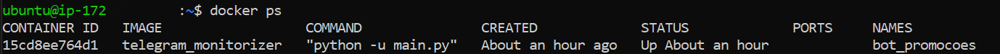
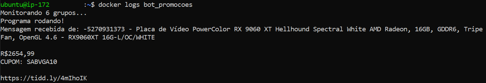
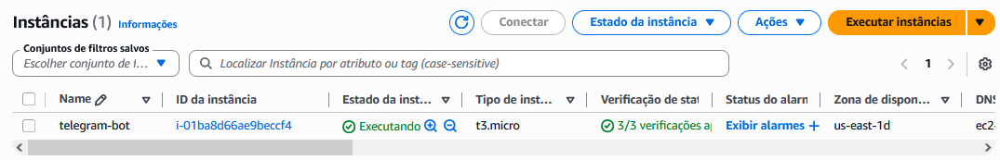
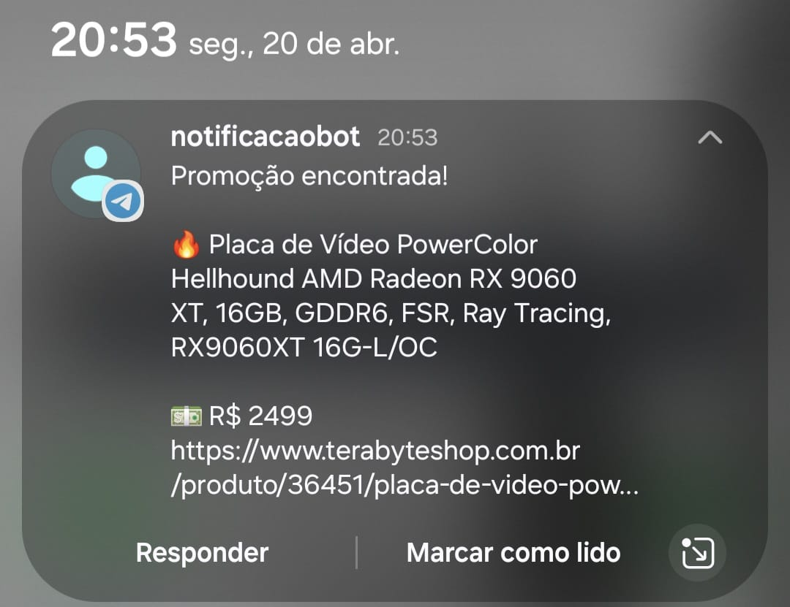

# 🤖 Telegram Deal Monitor

> Monitor de promoções em tempo real para grupos do Telegram — containerizado com Docker e implantado na AWS EC2.


---

## 📌 Sobre o Projeto

Bot de monitoramento que escuta mensagens em grupos do Telegram em tempo real, filtra produtos de interesse usando **regex**, e envia notificações instantâneas via bot — tudo rodando 24/7 em uma instância EC2 na AWS.

O projeto nasceu de uma necessidade real: não perder promoções relâmpago de hardware em grupos de ofertas. Hoje roda em produção monitorando mais de 5 grupos simultaneamente.

---

## 🏗️ Por que AWS EC2?

O bot precisa de uma **conexão persistente e contínua** com o Telegram via protocolo MTProto — ele literalmente fica "ouvindo" os grupos em tempo real, sem interrupção. Isso elimina de cara soluções serverless como AWS Lambda (limite de 15 minutos de execução) ou qualquer arquitetura orientada a eventos que pressupõe execuções curtas.

A EC2 foi escolhida por alguns motivos:

**Processo de longa duração**: O `run_until_disconnected()` do Telethon mantém uma conexão TCP aberta indefinidamente. Só uma VM tradicional suporta esse modelo de execução.

**Custo zero no Free Tier**: Uma instância `t3.micro` (2 vCPU, 1GB RAM) é mais do que suficiente para o workload do bot e entra no nível gratuito da AWS por 12 meses — custo operacional zero para um projeto pessoal.

**Simplicidade operacional**: Docker na EC2 permite replicar exatamente o ambiente local em produção, sem surpresas. O mesmo `docker run` que funciona na máquina funciona na nuvem.

**Controle total**: Diferente de soluções gerenciadas como ECS, a EC2 dá controle direto sobre o ambiente — útil para gerenciar o arquivo de sessão do Telethon via volume Docker, que precisa persistir entre reinicializações do container.

Alternativas consideradas e descartadas: **Lambda** (limite de tempo), **ECS Fargate** (overhead desnecessário para um único container).

---

## ⚙️ Stack & Tecnologias

| Tecnologia | Uso |
|---|---|
| **Python 3.11** | Linguagem principal |
| **Telethon** | Cliente MTProto para Telegram |
| **Telegram Bot API** | Envio de notificações push |
| **Regex** | Filtragem inteligente de mensagens |
| **Docker** | Containerização da aplicação |
| **AWS EC2** | Hospedagem 24/7 em nuvem |
| **python-dotenv** | Gerenciamento seguro de credenciais |

---

## 🚀 Como Funciona

1. O bot se conecta ao Telegram via **MTProto** usando a biblioteca Telethon
2. Escuta mensagens em tempo real nos grupos monitorados
3. Aplica filtros **regex** para identificar produtos de interesse
4. Ao detectar uma promoção, dispara uma notificação via **Telegram Bot API**
5. Roda continuamente em um container Docker na **AWS EC2**

---

## 🛠️ Como Rodar Localmente

### Pré-requisitos
- Python 3.11+
- Docker
- Conta na API do Telegram (api_id e api_hash)

### 1. Clone o repositório
```bash
git clone https://github.com/seu-usuario/telegram-deal-monitor.git
cd telegram-deal-monitor
```
### 2. Obtenha as credenciais necessárias
 
**API_ID e API_HASH** (Telethon):
1. Acesse [my.telegram.org](https://my.telegram.org) e faça login
2. Vá em **API Development Tools**
3. Crie um app e copie o `api_id` e `api_hash`
**BOT_TOKEN** (notificações):
1. Abra o Telegram e procure por `@BotFather`
2. Mande `/newbot` e siga as instruções
3. Copie o token gerado
**CHAT_ID** (seu ID pessoal):
1. Mande qualquer mensagem para o bot que você criou
2. Acesse no navegador: `https://api.telegram.org/bot<SEU_TOKEN>/getUpdates`
3. Procure pelo campo `"id"` dentro de `"chat"` — esse é seu CHAT_ID

### 3. Configure as variáveis de ambiente
```bash
cp .env.example .env
# Edite o .env com suas credenciais
```

```env
API_ID=seu_api_id
API_HASH=seu_api_hash
BOT_TOKEN=seu_bot_token
CHAT_ID=seu_chat_id
```

### 4. Gere a sessão do Telethon
```bash
pip install telethon python-dotenv
python3 -c "
import os
from dotenv import load_dotenv
from telethon.sync import TelegramClient
load_dotenv()
client = TelegramClient('sessao/telegram_deal_monitor', int(os.getenv('API_ID')), os.getenv('API_HASH'))
client.start()
client.disconnect()
"
```

### 5. Build e execução com Docker
```bash
docker build -t telegram-deal-monitor .
docker run -d \
  --name bot_promocoes \
  --env-file .env \
  -v $(pwd)/sessao:/app/sessao \
  telegram-deal-monitor
```

### 6. Verifique os logs
```bash
docker logs -f bot_promocoes
```

---

## ☁️ Deploy na AWS EC2

### 1. Crie uma instância EC2
- AMI: Ubuntu 24.04 LTS
- Tipo: t3.micro (Free Tier)
- Security Group: liberar porta 22 (SSH) apenas para seu IP

### 2. Conecte via SSH
```bash
ssh -i sua-chave.pem ubuntu@<IP_DA_INSTANCIA>
```

### 3. Instale o Docker
```bash
sudo apt update
sudo apt install -y docker.io
sudo systemctl enable docker
sudo usermod -aG docker ubuntu
```

### 4. Copie o projeto
```bash
# Na sua máquina local
rsync -av --exclude='.venv' --exclude='__pycache__' \
  -e "ssh -i sua-chave.pem" \
  ./telegram-deal-monitor ubuntu@<IP>:~
```

### 5. Gere a sessão e suba o container
```bash
# Na EC2
cd telegram-deal-monitor
python3 -c "..." # mesmo script da etapa local
docker build -t telegram-deal-monitor .
docker run -d --name bot_promocoes --env-file .env \
  -v $(pwd)/sessao/session.session:/app/sessao/session.session \
  telegram-deal-monitor
```

---

## 📁 Estrutura do Projeto

```
telegram-deal-monitor/
├── main.py              # Lógica principal do bot
├── Dockerfile           # Configuração do container
├── requirements.txt     # Dependências Python
├── .env.example         # Template de variáveis de ambiente
├── .dockerignore        # Arquivos ignorados pelo Docker
└── sessao/              # Pasta da sessão Telethon (não commitada)
```

---

## 🔒 Segurança

- Credenciais gerenciadas via variáveis de ambiente (nunca hardcoded)
- Arquivo `.session` e `.env` no `.gitignore` e `.dockerignore`
- Acesso SSH restrito ao IP do administrador via Security Group

---

## 📈 Aprendizados & Desafios

- **MTProto vs Bot API**: O Telethon usa o protocolo MTProto (cliente real), permitindo monitorar grupos sem ser admin — diferente de bots convencionais
- **Sessão única**: O Telegram não permite a mesma sessão em dois IPs simultâneos — resolvido gerando a sessão diretamente na EC2
- **Volumes Docker**: Persistência do arquivo `.session` via bind mount para sobreviver a reinicializações do container
- **WSL + Docker**: Caminhos de volume precisam ser nativos do WSL, não do Windows (`/mnt/c/...`)

---

## 🖼️ Imagens do Projeto

### **1. Status do Container**
> **Orquestração com Docker**: Visualização do container `bot_promocoes` em execução, demonstrando o isolamento da aplicação e o tempo de atividade estável.


### **2. Monitoramento e Lógica de Filtragem**
> **Logs em tempo real**: O bot processando o fluxo de mensagens via MTProto. Note o filtro Regex identificando com sucesso uma oferta da **RX 9060 XT**, conforme os parâmetros definidos no código.


### **3. Infraestrutura Cloud (AWS)**
> **Console AWS**: Instância `t3.micro` provisionada na região `us-east-1`. A escolha dessa infraestrutura garante que o bot opere 24/7 com custo zero dentro do Free Tier da AWS.


### **4. Resultado Final: Notificação Push**
> **Experiência do Usuário**: Notificação instantânea enviada via Telegram Bot API após a validação da oferta. O fluxo completo garante que o alerta chegue ao dispositivo móvel em poucos segundos.



---

## 📄 Licença

MIT License — sinta-se livre para usar e adaptar.
